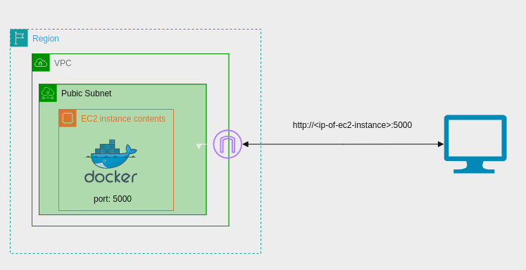
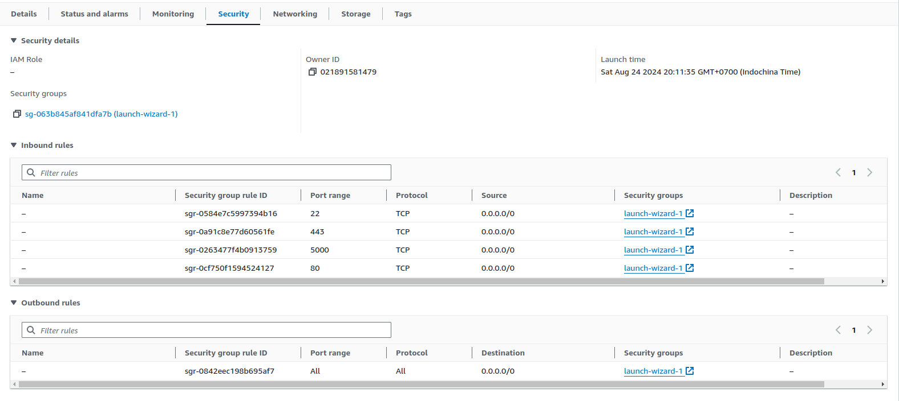

# AWS Lab - EC2 - 001
This lab is to create an EC2 instance in AWS and host a simple web page.

## Diagram


## Steps
1. Create an EC2 instance
2. Create a security group

Create port 5000 for HTTP with source 0.0.0.0
3. Connect to the EC2 instance
4. Pull docker image and run the container
```bash
docker pull datdt185/my-flask-app
docker run -d -p 5000:5000 datdt185/my-flask-app
```
After running the container, you check container status by running `docker ps`.
0.0.0.0:5000 -> 5000/tcp is the port mapping from the container to the host.
5. Access the web page
```
Access http://<EC2-Public-IP>:5000 to see the web page.
```


